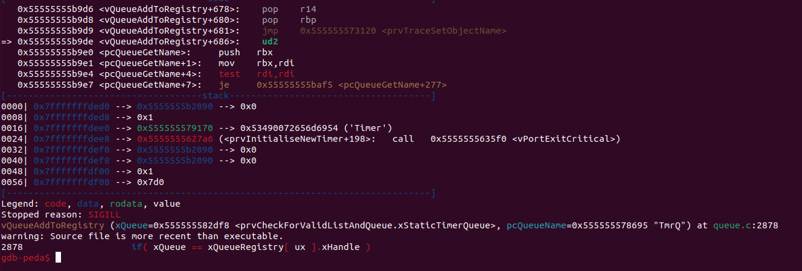

# Example working of Checked C

This folder contains the kernel source code that was modified to add an out-of-bounds access.
We modify the function `vQueueAddToRegistry` inside the `queue.c`.

```c
void vQueueAddToRegistry(QueueHandle_t xQueue, _Nt_array_ptr<const char> pcQueueName)
{
    if( pcQueueName != NULL )
    {
        for( ux = ( UBaseType_t ) 0U; ux < ( UBaseType_t ) configQUEUE_REGISTRY_SIZE + 1; ux++ )
        {
            if( xQueue == xQueueRegistry[ ux ].xHandle )
            {
                pxEntryToWrite = &( xQueueRegistry[ ux ] );
                break;
            }
            else if( ( pxEntryToWrite == NULL ) && ( xQueueRegistry[ ux ].pcQueueName == NULL ) )
            {
                pxEntryToWrite = &( xQueueRegistry[ ux ] );
            }
            else
            {
                mtCOVERAGE_TEST_MARKER();
            }
        }
    }
}
```
```c
PRIVILEGED_DATA QueueRegistryItem_t xQueueRegistry _Checked[ configQUEUE_REGISTRY_SIZE ];
```

We added a `+ 1` in the `for` loop termination condition. This causes `ux` to go till `configQUEUE_REGISTRY_SIZE`
and trigger an Illegal Instruction.


```sh
$ ./build/posix_demo 

Trace started.
The trace will be dumped to disk if a call to configASSERT() fails.
Starting echo blinky demo
Illegal instruction (core dumped)
```

We can verify that the crash is happening where we expected it to happen by using [gdb](https://www.sourceware.org/gdb/).


[ud2](http://www.nacad.ufrj.br/online/intel/vtune/users_guide/mergedProjects/analyzer_ec/mergedProjects/reference_olh/mergedProjects/instructions/instruct32_hh/vc316.htm)(Undefined Instruction) is the instruction Checked C uses to terminate the program execution.
